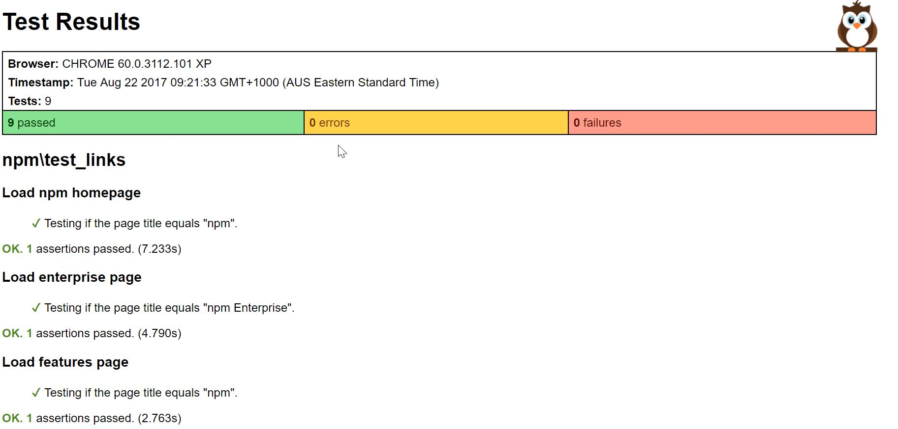

# nightwatch-web :new_moon_with_face::watch:
Page Object Model running across all browsers (not yet Safari ... or Opera ...)


## Commands

Open a CLI and try the following:

- Run a single test file on a single brower (chrome, ie, ff, edge)

```.\node_modules\.bin\nightwatch .\tests\npm\test_links.js -r .\html-reporter.js -c .\utilities\nightwatch.json -e ff```

- Run all tests on chrome 

```npm test```

- Run all tests on chrome, ie, ff (edge left out as it has issues)

```npm run test-all``` :bow:

## Extras

You can also have your html reports open on a separate monitor and use the following command to auto-reload the files for the latest test reports :point_left:

```npm run start-server``` 

Each time a test run completes, it will overwrite the current html of that browser thus causing the page to reload 



### Notes

http://nightwatchjs.org/guide
http://nightwatchjs.org/api#protocol
http://nightwatchjs.org/api/#commands

- edge is having issues, cannot click web elements which in turns fails ALL edge related tests. Can enter text, verify elements, etc but no clicking
- chrome, ie, firefox work fine. Currently Safari or Opera not supported, Edge is however as stated above, it has issues
- Within report, only nightwatch assert + commands are printed. All asserts have an optional string parameter to replace the printed assert result
- Nightwatch team comms: Delays with responding to PRs, changes, requests
- Nightwatch’s async operations rely on callback functions
- Best use cases are many test files with 1 or 2 tests in each
- Can run ```groups``` (folders) containing tests. If organised successfully, can be of great use (run smoke, login, breaking tests for example) :smirk:
- Can append timestamp to end of report files to allow report history.
- Not sure why Chrome report appends "XP" to filename
